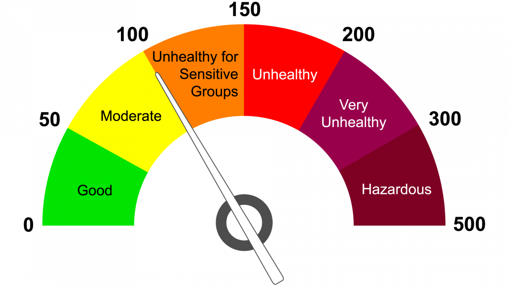

# project-3-group-08

## **Global Air Quality Index Analysis**

This project explores global air quality trends using an Air Quality Index (AQI) dataset. The AQI, developed by the EPA, measures the presence of five major pollutants and assigns a score from 0 to 500, with higher scores indicating greater health risks.

## Project Goals

- Analyze AQI values across cities and countries
- Raise awareness about air pollution's impact
- Empower informed decisions through data visualization

## Data and Methodology

- Dataset: World Air Quality Index by City and Coordinates (Kaggle)
- Tools: Python, Flask, SQLite, JavaScript, HTML, CSS
- Visualizations: Interactive dashboard with bar charts and table, heatmap with marker clusters

## Key Findings

- Worst air quality: Cities in Pakistan, Russia, South Africa, and Durango, CO (AQI = 500)
- Best air quality: Ecuador (majority of cities with 'good' or 'moderate' AQI)
- Similarities in AQI levels vary by region: Europe shows more consistency, while China and India exhibit greater variability

## Limitations

- Inaccurate country labels in dataset
- Heatmap impact reduced due to large dataset size
- Potential inconsistencies in AQI measurement standards across countries
- Lack of data on natural disasters impacting air quality

## Conclusion

This project provides valuable insights into global air quality patterns and demonstrates the power of data visualization in environmental awareness. The interactive dashboard and map allow users to explore AQI data at various levels, fostering a deeper understanding of air pollution's complexities.
